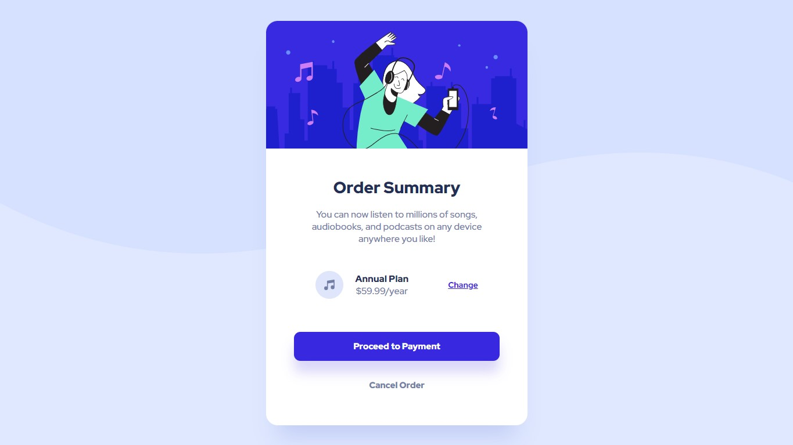

# Frontend Mentor - Order summary card solution

This is a solution to the [Order summary card challenge on Frontend Mentor](https://www.frontendmentor.io/challenges/order-summary-component-QlPmajDUj). Frontend Mentor challenges help you improve your coding skills by building realistic projects. 

## The challenge

Users should be able to:

- See hover states for interactive elements

## Screenshot

## Links

- [Frontend Mentor Solution](https://www.frontendmentor.io/solutions/order-summary-card-with-html-css-and-flex-gtGJzXrNpY)
- [Deployment GitHub Pages](https://fransuelton.github.io/order-summary-component/)

## Built with

- Semantic HTML5 markup
- CSS custom properties
- Flexbox

## Author

- Frontend Mentor - [@Fransuelton](https://www.frontendmentor.io/profile/Fransuelton)
- LinkedIn - [@Fransuelton](https://www.linkedin.com/in/fransuelton/)